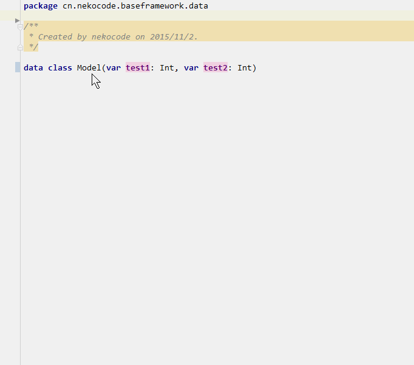

# Android Parcelable boilerplate code generation( for kotlin's data class)
**Inspired by [android-parcelable-intellij-plugin](https://github.com/mcharmas/android-parcelable-intellij-plugin)**

## Installation
Plugin is uploaded to plugin repository. If you like, you can also install it manually:

 0. Download `ParcelableGenerator` [release](https://github.com/nekocode/android-parcelable-intellij-plugin-kotlin/releases)
 0. Open IntelliJ/Android Studio
 0. *Preferences* -> *Plugins* -> *Install plugin from disk...*.
 0. Choose the downloaded jar file

### Dependencies
It depend on `kotlin-plugin` in version **`1.0.0-beta-4589`** or a newer version.

## Usage
Just press ALT + Insert (or your equivalent keybinding for code generation) in your editor and select Parcelable. It will auto generate Parcelable boilerplate code for your data class.  



## Now Suported Types
- Types implementing `Parceable` or `Serializable`
- Primitive Kotlin types: `String`, `Byte`, `Double`, `Float`, `Int`, `Long`, `Boolean`, `Char`
- List of any objects **(Warning: validation is not performed)**

## License
```
Copyright (C) 2016 Nekocode (https://github.com/nekocode)

Licensed under the Apache License, Version 2.0 (the "License");
you may not use this file except in compliance with the License.
You may obtain a copy of the License at

     http://www.apache.org/licenses/LICENSE-2.0

Unless required by applicable law or agreed to in writing, software
distributed under the License is distributed on an "AS IS" BASIS,
WITHOUT WARRANTIES OR CONDITIONS OF ANY KIND, either express or implied.
See the License for the specific language governing permissions and
limitations under the License.
```